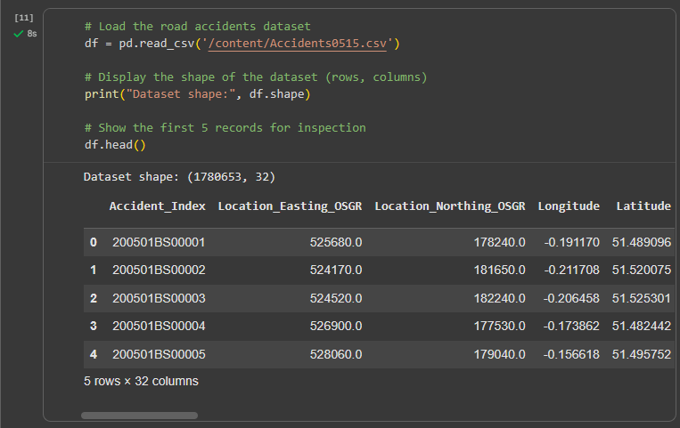
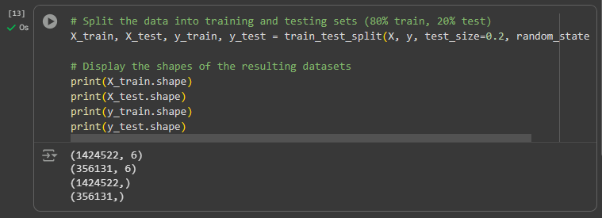
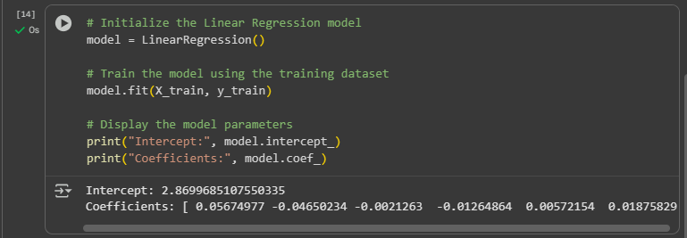
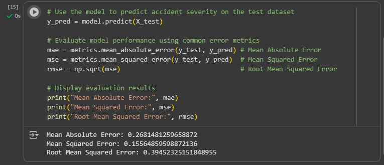
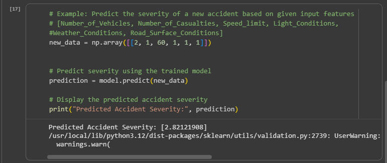

# Road Accident Severity Prediction using Linear Regression

## Overview
This project applies **Linear Regression** to analyze and predict the **severity of road accidents** based on several influencing factors.  
The work demonstrates the practical use of supervised learning in data-driven decision-making, particularly for traffic safety management in underdeveloped countries.

---

## Dataset
The dataset used in this analysis was sourced from a road accident records collection.  
Due to its large size, it is hosted externally and can be accessed here:

🔗 [Download Dataset (Google Drive)](https://drive.google.com/file/d/120dfP-s9BPJhI5dtPiv75eMJWUqL6Sc0/view?usp=sharing)

---

## Implementation Steps and Previews

| Step | Description | Preview |
|------|--------------|----------|
| 1 | Dataset Loaded |  |
| 2 | Dependent & Independent Variables Identified |  |
| 3 | Train/Test Split |  |
| 4 | Model Coefficients |  |
| 5 | Evaluation Metrics |  |
| 6 | Prediction Result |  |

---

## Files in the Repository

| File | Description |
|------|--------------|
| `road_accident_model.pkl` | Trained Linear Regression model saved for reuse |
| `screenshots/` | Folder containing the implementation and result screenshots |
| `README.md` | Project documentation file (this document) |

---

## Tools and Libraries
- **Python 3**
- **Google Colab**
- **Pandas** and **NumPy** – Data handling  
- **Scikit-learn** – Model training and evaluation  
- **Matplotlib** and **Seaborn** – Data visualization

---

## How to Run the Project
1. Open the notebook or `.pkl` file in Google Colab.  
2. Load the dataset from the provided Google Drive link.  
3. Run all code cells sequentially.  
4. Review the screenshots for reference on each step’s output.  

Example of loading the dataset:
```python
import pandas as pd
url = 'https://drive.google.com/uc?id=120dfP-s9BPJhI5dtPiv75eMJWUqL6Sc0'
data = pd.read_csv(url)
data.head()
